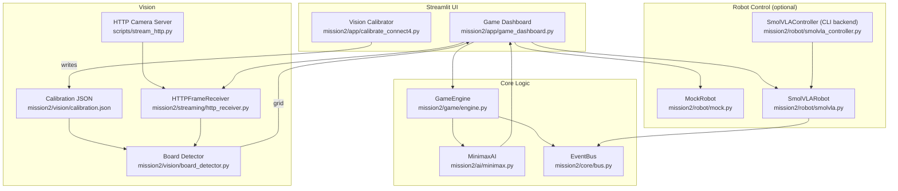
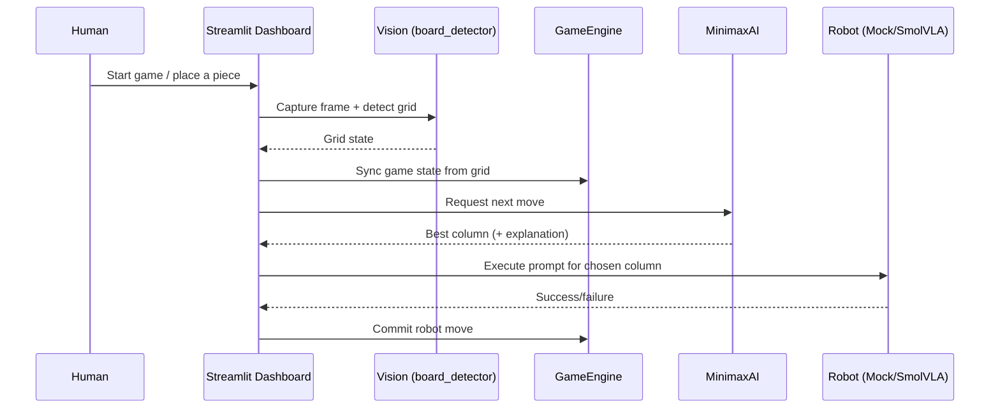

# AMD Robotics Hackathon 2025 - Team 15

SO-101 robot arm imitation learning using LeRobot and AMD ROCm.

## Team Information

**Team:** Team 15 (Josu Gorostegui and Jorge Lamperez)

**Summary:** A modular Connect 4 robotic opponent with a Streamlit operator UI, calibrated vision, and SmolVLA robot execution via natural-language prompts.

---

## Mission 2: Connect 4

Mission 2 is built as a composable pipeline: **Vision → Game Engine → AI → Robot**, operated from a Streamlit dashboard.

For a longer runbook (plus submission copy/paste), see `docs/mission2.md`.

### Setup

```bash
cd AMD_Robotics_Hackathon_Team15
cp .env.example .env
uv sync
```

### Quickstart (No Hardware)

```bash
uv run streamlit run mission2/app/game_dashboard.py
```

### Real Vision (HTTP)

#### 1) Start the camera server (on the camera machine)

```bash
uv run python scripts/stream_http.py --camera 0 --port 8080
```

#### 2) Calibrate board detection (operator machine)

```bash
uv run streamlit run mission2/app/calibrate_connect4.py
```

Save calibration to `mission2/vision/calibration.json` (default).

#### 3) Use vision in the game dashboard

```bash
uv run streamlit run mission2/app/game_dashboard.py
```

In the sidebar:
- **Vision Mode**: `Real (HTTP)`
- Use **Detect & Sync** (manual) or enable **Live Mode** (continuous sync)

### SmolVLA

The dashboard and CLI can run the robot if you provide a policy and the robot is connected.

#### Dashboard

```bash
uv run streamlit run mission2/app/game_dashboard.py
```

In the sidebar:
- **Robot Mode**: `SmolVLA`
- **Policy path / HF repo**: set your policy
- **Subprocess backend**:
  - `direct-inference`: one-shot runner
  - `lerobot-record`: records evaluation episodes

#### CLI

```bash
uv run python -m mission2.cli.main play --policy <POLICY>
uv run python -m mission2.cli.main inference <POLICY> task1 task2:3
uv run python -m mission2.cli.main inference <POLICY> --interactive
```

### Configuration (practical)

The dashboard/CLI load `.env` from the repo root. Start from `.env.example`.

Common knobs:
- `VISION_CALIBRATION_PATH` (default: `mission2/vision/calibration.json`)
- `STREAM_HOST` (camera server host)
- `MISSION2_GRID_METHOD` (grid inference method: `sample_hsv|hybrid|hough`)
- `SMOLVLA_POLICY` (default policy shown in the dashboard)
- `FOLLOWER_PORT`, `FOLLOWER_ID` (robot serial + id)
- `TASKS_JSON` (task prompt file; default: `mission2/tasks_smolvla.json`)

---

## System Architecture (Mission 2)

### High-level diagram (implemented components)

```
┌─────────────────────────────────────────────────────────────────────────────┐
│                               CONNECT 4 SYSTEM                               │
│                                                                             │
│  Camera ──HTTP──▶ Vision (board_detector) ──grid──▶ GameEngine ──▶ Minimax  │
│                     ▲            │                    │                     │
│                     │            │                    │ move + prompt       │
│                             Streamlit UI              ▼                     │
│            (Calibrator)   (Dashboard operator)   Robot (Mock/SmolVLA)       │
└─────────────────────────────────────────────────────────────────────────────┘
```

### Component graph



### Turn-by-turn flow



---

## Submission Details (Mission 2)

### 1) Mission Description
- Build an interactive Connect 4 robotic opponent on a physical 5×5 board: perceive the board, choose a move, and optionally execute it with the robot arm.

### 2) Creativity
- **Prompt-based actuation**: game moves are expressed as natural-language tasks, keeping game logic independent from robot kinematics.
- **Operator tooling**: dashboard + calibrator make the demo repeatable across setups.

### 3) Technical Implementations
- **Teleoperation / dataset capture**: multi-task prompts live in `mission2/tasks_smolvla.json`; evaluation can be recorded via `lerobot-record`.
- **Training**: `mission2/code/training-models-on-rocm-smolvla.ipynb`.
- **Inference**: dashboard supports SmolVLA execution; CLI supports an in-process controller backend and a `lerobot-record` backend.

### 4) Ease of Use
- **Mock-first workflow**: run the dashboard/CLI without hardware.
- **Single control surface**: dashboard centralizes vision sync, AI planning, and robot execution.
- **Calibration UI**: interactive calibration saved as a single JSON file.

---

## Additional Links

**Dataset**: [jlamperez/mission2_smolvla_multitask_v2_120ep](https://huggingface.co/datasets/jlamperez/mission2_smolvla_multitask_v2_120ep)

**Model**: [jlamperez/mission2_smolvla_multitask_policy_30ksteps_120ep](https://huggingface.co/jlamperez/mission2_smolvla_multitask_policy_30ksteps_120ep)

**Training Notebook**: `mission2/code/training-models-on-rocm-smolvla.ipynb`

---

## Mission 1: Pick & Place

Runbook: `docs/mission1.md`

**Dataset**: [jlamperez/mission1_pick_place](https://huggingface.co/datasets/jlamperez/mission1_pick_place)

**Model**: [jlamperez/act_mission1_pick_place](https://huggingface.co/jlamperez/act_mission1_pick_place)

**Training Notebook**: `mission1/code/training-models-on-rocm.ipynb`

---

## Tech Stack

- [LeRobot](https://github.com/huggingface/lerobot) v0.4.2+
- SO-101 robot arm (6-DOF + gripper)
- AMD Instinct MI300X (ROCm 6.3)
- [uv](https://github.com/astral-sh/uv) package manager

---

## License

MIT
