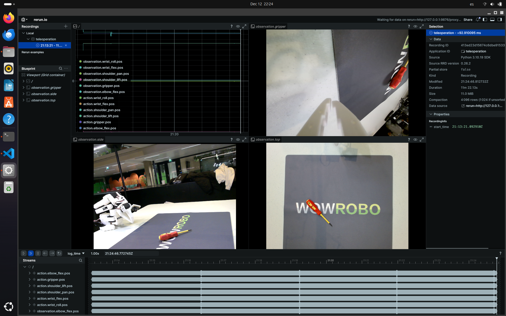

# Mission 1: Pick & Place

## Overview

Train an ACT policy for autonomous pick-and-place using teleoperated demonstrations.

## Data Collection

```bash
# Calibrate arms (once per setup)
./scripts/calibrate_robot.sh both

# Record 50 demonstration episodes
./scripts/record_dataset.sh

# Upload to HuggingFace Hub
./scripts/upload_dataset.sh ~/so101_datasets/mission1_pick_place
```

**Recording controls**: `←` re-record, `→` skip, `ESC` stop

## Training

On AMD MI300X (see `mission1/code/training-models-on-rocm.ipynb`):

```bash
lerobot-train \
  --dataset.repo_id=jlamperez/mission1_pick_place \
  --policy.type=act \
  --steps=50000 \
  --batch_size=32 \
  --policy.device=cuda \
  --policy.push_to_hub=true \
  --policy.repo_id=jlamperez/act_mission1_pick_place
```

## Inference

```bash
./scripts/run_inference.sh jlamperez/act_mission1_pick_place
```

## Results

- **Policy**: ACT (Action Chunking Transformer)
- **Training**: 50k steps on MI300X
- **Dataset**: 50 episodes, 3 cameras (top, side, gripper)

## Data Visualization

3-camera setup captured during teleoperation (top, side, gripper views):


