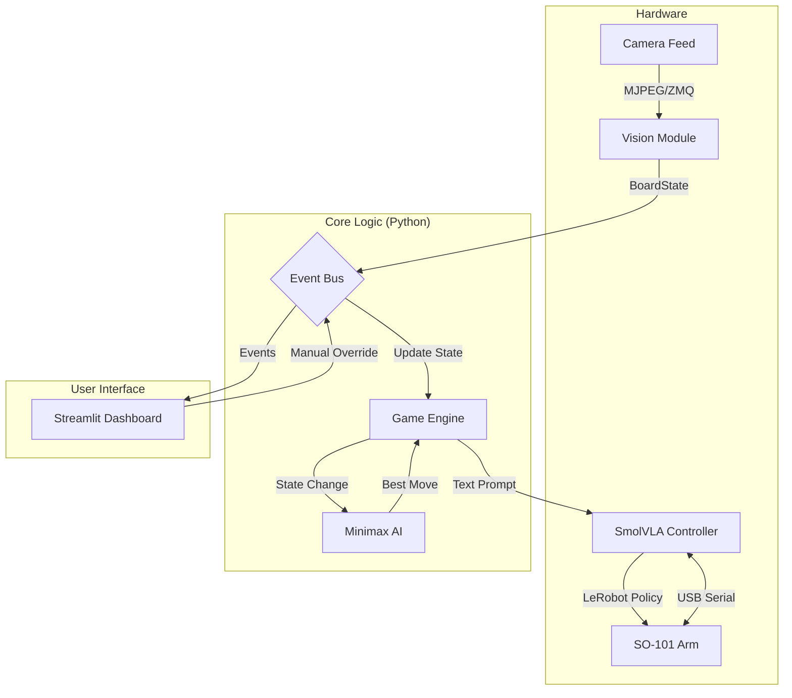
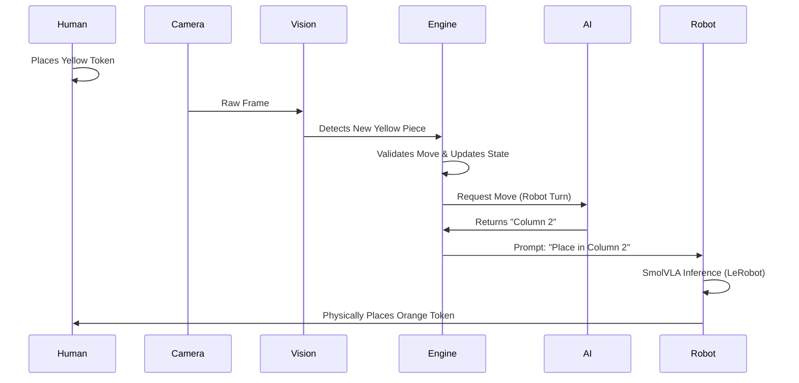

Based on the codebase provided, here is the explanation for Mission 2: Connect 4, structured for your hackathon submission.

---

## 1. Mission 2 Description: "Robotic Connect 4 Opponent"

For the freestyle mission, we developed an interactive, autonomous robotic opponent that plays Connect 4 against a human on a physical 5x5 grid playing basketball.

Unlike simple hard-coded pick-and-place demos, this system closes the loop between perception, cognition, and action. The robot visually observes the board state, calculates the optimal move using game theory, and executes the move using a Vision-Language-Action (VLA) model powered by LeRobot.

**Key Features:**
*   **Real-time Perception:** Uses computer vision to detect the game board and token positions (Orange vs. Yellow balls) despite changes in lighting or angle.
*   **Strategic AI:** An algorithm to actively try to defeat the human player.
*   **VLA-Driven Control:** Instead of hard-coded coordinates, the robot is controlled via natural language prompts (e.g., *"Pick the orange ball and place it in column 2"*) using the **SmolVLA** model trained on AMD MI300X GPUs.
*   **Robust Game State Management:** The system automatically reconciles physical board state with internal logic, handling scenarios where the human plays out of turn or the camera misses a frame.

---

## 2. Creativity

Our solution stands out by transforming the standard LeRobot "Hello World" into a dynamic, adversarial game environment.

*   **Natural Language Actuation:** We moved beyond standard coordinate-based motion planning. We fine-tuned `SmolVLA` to understand semantic game actions. The game engine emits text commands, and the VLA policy translates that intent into motor torque.
*   **Hybrid Vision Pipeline:** We implemented a sophisticated hybrid vision system that combines HSV color thresholding with Hough Circle Transform and perspective warping. This allows the system to be robust against partial occlusions (e.g., the robot arm momentarily blocking the camera).
*   **"Living" Dashboard:** We built a centralized `EventBus` architecture that decouples the robot, vision, and game logic. This allows us to have a rich Streamlit dashboard that visualizes the "brain" of the robot—showing exactly what the computer vision sees and why the AI made a specific move—making the AI explainable to the user.

---

## 3. Technical Implementation

The system is built on a modular, event-driven architecture designed for the AMD Ryzen™ AI platform.

### System Architecture Diagram

### Key Technical Components

1.  **Vision Pipeline (`mission2/vision`):**
    *   **Input:** Captures frames via ZMQ from the overhead camera.
    *   **Processing:** Applies a perspective transform (homography) to warp the board into a flat 5x5 grid.
    *   **Detection:** Uses a hybrid approach of HSV color sampling and Hough Circle detection to classify cells as Empty, Orange (Robot), or Yellow (Human).
    *   **Reconciliation:** The `GameEngine` compares the visual grid against the logical grid to detect when the human has made a move.

2.  **Cognition (`mission2/ai` & `mission2/game`):**
    *   **Game Engine:** Manages turn-taking and valid move generation. It includes logic to handle "desync" events if the vision system glitches.
    *   **Minimax AI:** searches the game tree to a depth of 5 moves, evaluating board states to block human wins and set up robot victories.

3.  **Actuation (`mission2/robot`):**
    *   **Training:** We collected teleoperation data using `lerobot-record` and trained a SmolVLA policy on **AMD Instinct MI300X** GPUs to associate visual inputs + text prompts with arm actions.
    *   **Inference:** The `SmolVLARobot` class receives a move command (e.g., Column 3), translates it to the prompt from `tasks_smolvla.json`, and runs inference locally on the AMD Ryzen AI laptop to execute the pick-and-place maneuver.

### Data Flow Diagram

---

## 4. Ease of Use

We prioritized usability to ensure the demo runs smoothly during the hackathon.

1.  **Unified Control Center:**
    *   A **Streamlit Dashboard** (`game_dashboard.py`) acts as the command center. Operators can see the live camera feed, the AI's confidence score, and the robot's status in one window.
    *   Includes a "Sync" button to instantly force the game logic to match the physical board if they get out of sync.

2.  **Visual Calibration Tool:**
    *   We built a dedicated **Calibration App** (`calibrate_connect4.py`). Instead of hardcoding camera coordinates, the user opens this app, clicks the 4 corners of the board on the live video feed, and adjusts color sliders. The settings save to `calibration.json` and are instantly loaded by the main game.

3.  **Resilience Modes:**
    *   **Mock Mode:** The entire system works without the robot hardware (using a virtual board) for logic testing.
    *   **Live Mode:** Connects seamlessly to the SO-101 arm and cameras via simple environment variable flags.

4.  **Hardware Abstraction:**
    *   The system uses a `RobotInterface` abstraction, allowing us to swap between a Mock robot (for UI testing) and the Real SmolVLA robot with a single toggle switch in the UI, ensuring safety during setup.